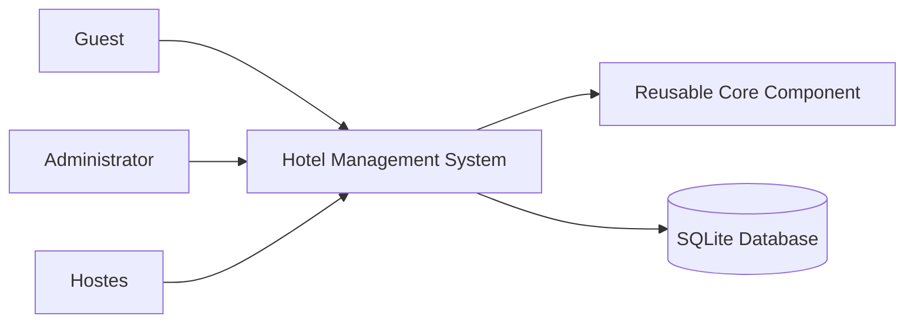
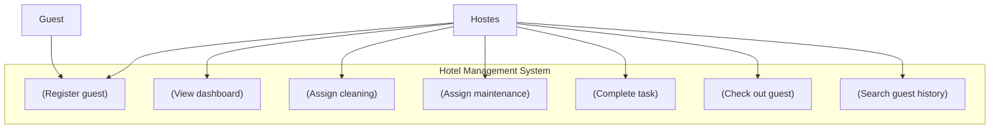
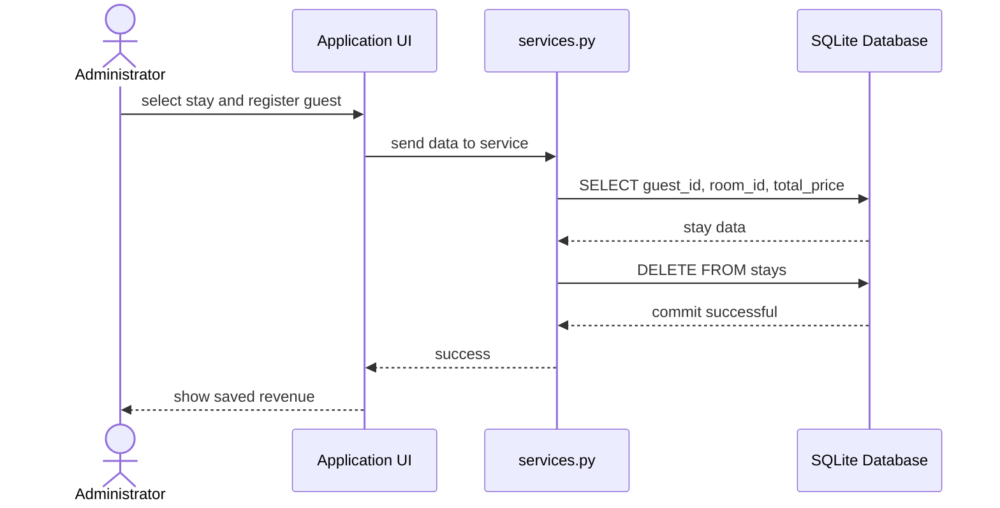

# Диаграммы

## Контекстная диаграмма

```mermaid
flowchart LR
    Guest[Guest]
    Hostes[Hostes]
    Admin[Administrator]

    HMS[Hotel Management System]
    Core[Reusable Core Component]
    DB[(SQLite Database)]

    Guest --> HMS
    Admin --> HMS
    Hostes --> HMS
    HMS --> Core
    HMS --> DB

```

## Диаграмма вариантов использования

```mermaid
flowchart TD
    subgraph "Hotel Management System"
        UC1["(Register guest)"]
        UC2["(View dashboard)"]
        UC3["(Assign cleaning)"]
        UC4["(Assign maintenance)"]
        UC5["(Complete task)"]
        UC6["(Check out guest)"]
        UC7["(Search guest history)"]
    end

    Hostes --> UC1
    Hostes --> UC2
    Hostes --> UC3
    Hostes --> UC4
    Hostes --> UC5
    Hostes --> UC6
    Hostes --> UC7
    Guest --> UC1

```

## Диаграмма последовательностей

```mermaid
sequenceDiagram
    actor Admin as Administrator
    participant UI as Application UI
    participant Service as services.py
    participant DB as SQLite Database

    Admin->>UI: select stay and register guest
    UI->>Service: send data to service
    Service->>DB: SELECT guest_id, room_id, total_price
    DB-->>Service: stay data
    Service->>DB: DELETE FROM stays
    DB-->>Service: commit successful
    Service-->>UI: success
    UI-->>Admin: show saved revenue

```
